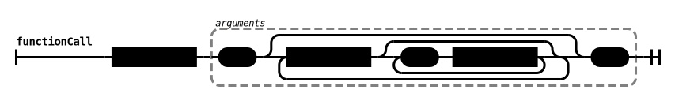
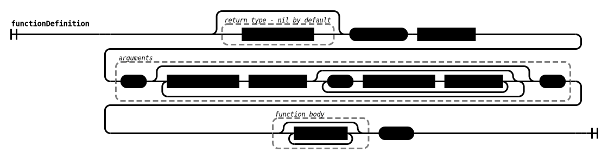
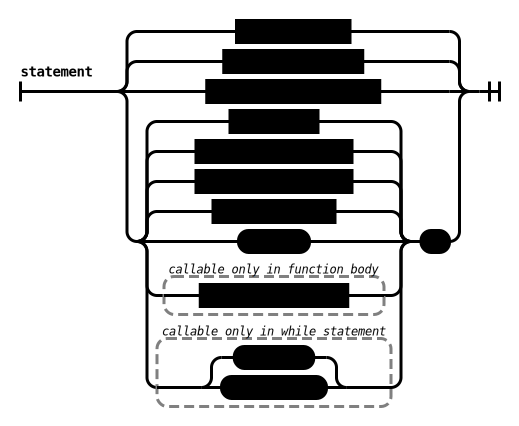
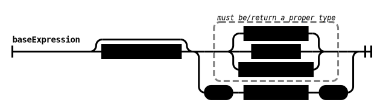

# TKOM Project - Skner - dokumentacja końcowa
Jakub Budrewicz

## Spis treści
1. [ Wstęp ](#wstep)
2. [ Opis funkcjonalności ](#opis)
3. [ Stary opis funkcjonalności (niespełniony) ](#stary_opis)
4. [ Przykłady ](#przyklady)
5. [ Specyfikacja i składnia ](#specyfikacja)
6. [ Szczegóły implementacyjne ](#implementacja)
7. [ Biblioteka standardowa ](#stdlib)
8. [ Uruchamianie ](#uruchamianie)
9. [ Testowanie ](#testowanie)
10. [ Dalsze rozszerzenia ](#rozszerzenia)

## Wstęp <a name="wstep"></a>
Skner jest docelowo językiem funkcyjnym stworzonym z przeznaczeniem do programowania muzyki, 
którego podstawą jest referencyjne traktowanie wszystkich zmiennych.
Język inspirowany jest funkcjonalnościami języka programowania wizualnego Pure Data oraz składnią Lua.


## Opis funkcjonalności <a name="opis"></a>

W ramach projektu TKOM udało mi się zrealizować wymagania funkcjonalności języka, 
poza działaniem referencyjnych zmiennych (w wersji ostatecznej są to zwykłe, niereferencyjne wartości, język
pozwala na używanie rekurencji, continue, break, exit oraz wypisywanie błędów w trybie konsoli).

## Docelowy opis funkcjonalności <a name="stary_opis"></a>
Najważniejszym wymaganiem języka jest możliwość korzystania z "funkcyjnych" zmiennych; oznacza to w rozumieniu tego projektu, 
że domyślnie, wartości zmiennych nie są kopiowane i zawsze, jeśli nie wskażemy inaczej, po przekazaniu
zmiennej do funkcji/innej zmiennej/tablicy, przechowującej ten sam typ danych,
możemy modyfikować wyjście lub wartość tych funkcji/innej zmiennej/tablicy za pomocą tej pierwszej zmiennej. 
Takie podejście jest uproszczeniem przepływu danych z języka programowania wizualnego Pure Data.

W Skner nie ma standardowych zmiennych, zamiast nich używane są lambdy (w tej dokumentacji w 
rozumieniu zmiennej, zawsze chodzi o lambdę).

Takie podejście stwarza szereg problemów:
- Każda zmienna jest przechowywana w pamięci jako drzewo operacji
  - jest to znacznie mniej efektywne niż przechowywanie samej wartości, lub referencji
- Po usunięciu zmiennej należy zaktualizować zmienne korzystające z niej
  - po usunięciu lambdy, wszystkie jej referencje są podmienione na jej ostatnią wartość
  - utrudnia to implementację, ponieważ należy przechowywać zależności pomiędzy lambdami w obydwie strony
- Po użyciu funkcji w wyrażeniu lambdy, lambda przechowuje referencję do tej funkcji
oraz jej argumentów
- Stałe wartości (literały oraz użycia operatora $), będące częścią lambdy muszą być przechowywane i usuwane 
razem z daną lambdą (są jej bezpośrednio podległe)

Funkcje w Skner nie mogą operować na globalnych identyfikatorach lambdach stworzonych przez użytkownika. Muszą one 
zostać przekazane za pomocą argumentów pozycyjnych.

Funkcje mogą za to operować na wszystkich wbudowanych słowach kluczowych oraz jakichkolwiek innych funkcjach 
stworzonych przez użytkownika lub wbudowanych. 

Funkcje nie mogą być przeładowywane, identyfikatory są unikalne.

### Wymagania funkcjonalne:

- Interpretowanie plików

- Interpretowanie bezpośrednio z konsoli

- Zgłaszanie błędów znalezionych podczas interpretacji

- Obsługa typów liczbowych, tekstowych oraz logicznych (string, number i boolean)

- Definiowalne przez użytkownika zmienne

- Definiowalne przez użytkownika funkcje

- Funkcyjny charakter zmiennych osiągnięty ma być za pomocą wymuszenia lambd (niespełnione)

- Możliwość używania lambd jako zwykłych, niereferencyjnych zmiennych (operator $) (niespełnione)

- Statyczne typowanie

- Mutowalność zmiennych

## Przykłady <a name="przyklady"></a>

Przykładowy program:
```
number a = 10;
print(a);
print(10);
number function fib(number a) # funkcja licząca ciąg fibbonaciego
   if(a < 2) return 1; end
   return fib(a-1) + fib(a-2);
end
print(fib(1));
print(fib(3));
a = 1;
while(a<20) # wypisanie pierwszych 20 elementów ciągu fibbonaciego
println(fib(a));
a = a + 1;
end
print(a);
~a # usunięcie zmiennej a
```


Program zgodny ze składnią języka, ale prezentujący funkcjonalności, które nie zostaną dodane do języka w ramach 
projektu TKOM ze względu na zbyt duży zakres (wbudowane funkcje muzyczne/do obsługi audio, tablice oraz typ `sequence`).

```
>>> println(list_interfaces()); # get table of computers audio interfaces (table of strings)
audio_interface_a, audio_interface_b
>>> println(string(select_interface("audio_interface_a")));
true
>>> start(); # start audio (and clock)
>>> number function osc_dummy(number multiplier) 
...     return sin(get_tic() / multiplier);
... end
>>>
>>> number a = 15;
>>> dac__add_play_function(osc_dummy(a)); # audio starts playing
>>> a = 60; # played frequency changes
>>> println(string(dac__list_play_functions()));
dac_osc_dummy
>>> dac__remove_play_function(0);
>>> ~a # delete "a" variable and everything that has a reference to it
>>> # using native oscillator function (sinewave by default)
>>> number osc_1_frequency = 500;
>>> dac__add_play_function(oscillator(osc_1_frequency)); # play 500 Hz sinewave
>>> osc_1_frequency = 440; # change played frequency
>>> dac__remove_play_function(0); # remove dac_oscillator_1
>>>
>>> # using sequences
>>> println(string(get_bpm()));
123
>>> set_bpm(120); # set global bpm value
>>> table seq_frequencies = [osc_1_frequency,0,412,323,880];
>>> sequence seq_1 = sequence(seq_frequencies, [2,1,1,1,1], 1) ;
>>> # seq_1 value represents frequency (number) and changes in time
>>> dac__add_play_function(oscillator(seq_1)); # sequence seq_1 is now playing
>>> a=2000 ;# change first note frequency in seq_1 
>>> stop() ;# stop audio
```
## Specyfikacja i składnia <a name="specyfikacja"></a>

Lista zdefiniowanych słów kluczowych:
`function`, `if`, `elif`, `else`, `while`, `return`, `number`, `boolean`, `break`, `continue`, `or`, `and`, `true`, `false`, `end`, `exit`

Enum tokenów:
```c++
enum TokenType {
/*-------------------- literals -------------------*/
    T_NUMBER_LITERAL = 256,
    T_BOOLEAN_LITERAL = 257,
    T_STRING_LITERAL = 258,

    /*-------------------- keywords -------------------*/
    /* functions  */
    T_FUNCTION = 259,
    T_CONTINUE = 260,
    T_BREAK = 261,
    T_RETURN = 262,

    /* statements */
    T_WHILE = 263,
    T_IF = 264,
    T_ELIF = 265,
    T_ELSE = 266,
    T_END = 267,

    /* type specifiers */
    T_NUMBER = 268,
    T_STRING = 269,
    T_BOOLEAN = 270,

    /* literals */
    T_TRUE = 271,
    T_FALSE = 272,

    /*------------------ identifiers ------------------*/
    T_IDENTIFIER = 273,

    /*------------------- operators -------------------*/
    T_GREATER_EQUAL = 274, // >=
    T_LESSER_EQUAL = 275, // <=
    T_GREATER = 276, // >
    T_LESSER = 277, // <
    T_NOT_EQUAL = 278, // !=
    T_EQUAL = 279, // ==
    T_NEGATE = 280, // !
    T_ASSIGNMENT = 281, // =

    /* single character */
    T_OR = '|',
    T_AND = '&',

    T_EVALUATE = '$',
    T_PLUS = '+',
    T_MINUS = '-',
    T_DIVIDE = '/',
    T_MULTIPLY = '*',
    T_MODULO = '%',
    T_DELETE = '~',

    /*------------------ punctuators ------------------*/
    T_COMMA = ',',
    T_OPEN_BRACKET = '(',
    T_CLOSE_BRACKET = ')',
    T_SEMICOLON = ';',

    /*--------------------- other ---------------------*/
    T_ETX = 282,
    T_UNDEFINED = 283,
    T_EXIT = 284,
};
```

### Komentarze:
Komentarze zaczynają się od znaku `#` i są pomijane w trakcie analizy leksykalnej, dlatego nie ma ich zdefiniowanych na liście tokenów ani w automacie.

### Biblioteka standardowa
Biblioteka standardowa obejmuje wbudowane funkcje:
- `println(string)`
- `print(string)`
- `read()`
- `string to_string(<any type>)`
- `number to_number(<any type>)`
- `boolean to_boolean(<any type>)`


### Opis automatu parsera:

ProgramStatement:


Functions:





Statements:




Expressions:




Types:


Operations:


Operators:


Basic:


## Szczegóły implementacyjne <a name="implementacja"></a>

Całość kodu zostanie napisana w C++.

### Main

Główny plik służy sczytaniu argumentu służy specyfikacji trybu interpretacji (konsola lub plik).
Domyślnie, błędy są wypisywane w konsoli na standardowe wyjście podczas interpretacji, za pośrednictwem kontrolera błędów
kontrolera.

### Moduł obsługi błędów

Każdy typ błędu interpretacyjnego ma zdefiniowany swój własny wyjątek; w razie napotkania takiego wyjątku
podczas analizy leksykalnej/składniowej lub interpretacji jest on rzucany, a w konsoli wyświetla się 
odpowiedni komunikat wraz z linijką i wierszem w kodzie. W przypadku interpretacji z pliku, interpreter przerywa
działanie przy pierwszym napotkanym błędzie.

### Moduł analizatora leksykalnego

Analiza leksykalna jest pierwszym etapem parsowania.
W tym miejscu kod zostanie podzielony na tokeny, które zostaną wykorzystane w późniejszych etapach.

### Moduł analizatora składniowego

W module analizatora składniowego zostanie przeprowadzone sprawdzenie składni programu oraz zbudowanie drzewa.

### Moduł interpretera

Moduł interpretera będzie służył wykonywaniu kodu zgodnie z drzewem pozyskanym z analizatora składniowego.
W tym module znajduje się kod odpowiadający za przechowywanie funkcji, istniejących zmiennych i wszystkie 
funkcjonalne właściwości interpretera.

Ważnym elementem modułu intepretera jest ewaluator, który dziedziczy po wirtualnym wizytorze drzewa AST.
Ewaluator zajmuje się wykonywaniem konkretnych procedur, ewaluacją expressions, a także rzuca odpowiednie wyjątki
w razie błędów interpretera;

## Uruchamianie <a name="uruchamianie"></a>

```bash
git clone https://gitlab-stud.elka.pw.edu.pl/tkom-22l-kg/Jakub_Budrewicz/skner-lang.git
cd skner-lang
mkdir build
cd build
cmake ..
make
```

Po kompilacji, w katalogu `build/` pojawi się plik wykonywalny `skner`.
Wykonanie polecenia `./skner` w katalogu, spowoduje uruchomienie języka w trybie interpretera.
Wykonanie polecenia `./skner <plik.sk>` zinterpretuje cały kod, wypisze jego wyjście na konsolę, po czym interpreter
zakończy pracę.

## Testowanie <a name="testowanie"></a>

Testy jednostkowe zostaną napisane z pomocą biblioteki `doctest`.

## Dalsze rozszerzenia <a name="rozszerzenia"></a>
Oczywiście pierwszym i najistotniejszym rozszerzeniem w razie dalszej pracy nad projektem będzie wprowadzenie funkcyjnego charakteru zmiennych.

W przypadku dalszego rozwijania projektu, przewidziałem powstanie następujących funkcji z biblioteki standardowej umożliwiające live coding (programowanie muzyki):
- `start()`,
- `stop()`,
- `get_tic()`,
- `set_tic(number)`,
- `get_bpm()`,
- `set_bpm(number)`,
- `dac__add_play_function(number)`
- `dac__remove_play_function(number)`
- `sin(number)`,
- `oscillator(number, string)`
- `list_interfaces()`
- `select_interface(string)`
Nie będę ich jednak opisywać, ponieważ wykracza to poza zakres projektu.

W rozszerzeniach przewidziałem także dodanie tablic oraz specjalny typ `sequence`.
